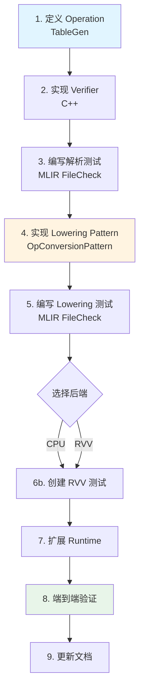
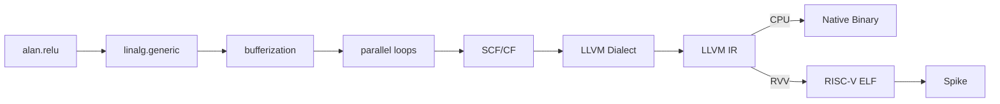
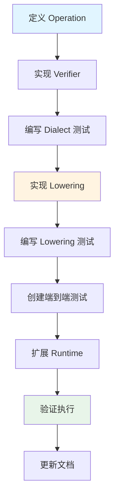

# 如何新增 OP 并 Lowering 到后端

本文档以 ReLU 算子为例,详细说明从操作定义到后端执行的完整流程。

## 目录

- [概览](#概览)
- [第一阶段:操作定义与验证](#第一阶段操作定义与验证)
- [第二阶段:Lowering 到 Linalg](#第二阶段lowering-到-linalg)
- [第三阶段:CPU 端到端执行](#第三阶段cpu-端到端执行)
- [第四阶段:RVV 端到端执行](#第四阶段rvv-端到端执行)
- [关键设计决策](#关键设计决策)

---

## 概览

### 完整流程



### 编译流水线



---

## 第一阶段:操作定义与验证

### 1.1 在 TableGen 中定义 Operation

**文件**: `include/Dialect/Alan/AlanOps.td`

**关键概念**:
- 使用 ODS (Operation Definition Specification) 定义操作
- 选择合适的 Trait 来声明操作的性质
- 定义输入参数和输出结果

**实现步骤**:

```tablegen
def ReluOp : Alan_Op<"relu", [
    InferTypeOpInterface,
    SameOperandsAndResultType]> {
  let summary = "ReLU activation function";
  let description = [{
    Applies the Rectified Linear Unit function element-wise:
    output = max(input, 0)
  }];

  let arguments = (ins AnyRankedTensor:$input);
  let results = (outs AnyRankedTensor:$result);

  let assemblyFormat = [{
    $input attr-dict `:` type($input) `->` type($result)
  }];

  let hasVerifier = 1;
}
```

**设计要点**:

1. **Trait 选择**:
   - `InferTypeOpInterface`: 允许类型推断
   - `SameOperandsAndResultType`: 输入输出类型相同

2. **参数定义**:
   - `AnyRankedTensor:$input`: 接受任意排名的张量
   - 单输入,单输出

3. **Assembly Format**:
   - 定义 MLIR 文本格式的解析/打印规则
   - `$input attr-dict : type($input) -> type($result)`

**验证**: 构建后检查生成的文件
```bash
cmake --build build
ls build/include/Dialect/Alan/AlanOps.h.inc  # 应该包含 ReluOp 声明
```

---

### 1.2 实现 Verifier

**文件**: `lib/Dialect/Alan/AlanDialect.cpp`

**关键概念**:
- Verifier 在操作创建时自动调用
- 检查类型、形状、属性等约束
- 返回 `LogicalResult` 表示成功或失败

**实现步骤**:

```cpp
LogicalResult ReluOp::verify() {
  auto inputType = mlir::cast<RankedTensorType>(getInput().getType());
  auto resultType = mlir::cast<RankedTensorType>(getResult().getType());

  // 1. 检查形状一致性
  if (inputType.getShape() != resultType.getShape()) {
    return emitError("result shape must match input shape, got ")
           << resultType.getShape() << " vs input " << inputType.getShape();
  }

  // 2. 检查元素类型
  if (inputType.getElementType() != resultType.getElementType()) {
    return emitError("result element type must match input, got ")
           << resultType.getElementType() << " vs input "
           << inputType.getElementType();
  }

  // 3. 检查支持的元素类型
  auto eltType = inputType.getElementType();
  if (!mlir::isa<FloatType>(eltType) && !mlir::isa<IntegerType>(eltType)) {
    return emitError("unsupported element type: ") << eltType;
  }

  return success();
}
```

**设计要点**:

1. **类型转换**: 使用 `mlir::cast` 进行安全的类型转换
2. **错误报告**: 使用 `emitError` 提供详细的错误信息
3. **验证顺序**: 先检查结构约束,再检查语义约束

**测试验证**:
```bash
# 创建测试文件
cat > /tmp/test_relu.mlir << 'EOF'
func.func @relu(%input: tensor<4xf32>) -> tensor<4xf32> {
  %result = alan.relu %input : tensor<4xf32> -> tensor<4xf32>
  return %result : tensor<4xf32>
}
EOF

# 解析测试
./build/tools/alan-opt/alan-opt /tmp/test_relu.mlir
# 应该成功打印
```

---

### 1.3 编写解析/验证测试

**文件**: `test/Dialect/Alan/relu.mlir`

**关键概念**:
- 使用 FileCheck 验证 MLIR 操作的解析和打印
- `RUN` 指令定义执行的命令
- `CHECK` 指令验证输出

**实现步骤**:

```mlir
// RUN: alan-opt %s | FileCheck %s

// CHECK-LABEL: func.func @relu_f32
func.func @relu_f32(%input: tensor<4xf32>) -> tensor<4xf32> {
  // CHECK: alan.relu
  // CHECK-SAME: tensor<4xf32>
  %result = alan.relu %input : tensor<4xf32> -> tensor<4xf32>
  return %result : tensor<4xf32>
}

// CHECK-LABEL: func.func @relu_rank2
func.func @relu_rank2(%input: tensor<2x3xf32>) -> tensor<2x3xf32> {
  // CHECK: alan.relu
  // CHECK-SAME: tensor<2x3xf32>
  %result = alan.relu %input : tensor<2x3xf32> -> tensor<2x3xf32>
  return %result : tensor<2x3xf32>
}
```

**运行测试**:
```bash
./build/tools/alan-opt test/Dialect/Alan/relu.mlir | \
  FileCheck test/Dialect/Alan/relu.mlir
```

---

### 1.4 编写验证失败测试

**文件**: `test/Dialect/Alan/invalid_relu.mlir`

**关键概念**:
- 使用 `expected-error` 验证错误情况
- 测试各种非法输入

**实现步骤**:

```mlir
// RUN: alan-opt %s 2>&1 | FileCheck %s

// CHECK: error: result shape must match input shape
func.func @shape_mismatch(%input: tensor<4xf32>) -> tensor<8xf32> {
  %result = alan.relu %input : tensor<4xf32> -> tensor<8xf32>
  return %result : tensor<8xf32>
}

// CHECK: error: result element type must match input
func.func @type_mismatch(%input: tensor<4xf32>) -> tensor<4xi32> {
  %result = alan.relu %input : tensor<4xf32> -> tensor<4xi32>
  return %result : tensor<4xi32>
}
```

**运行测试**:
```bash
./build/tools/alan-opt test/Dialect/Alan/invalid_relu.mlir 2>&1 | \
  FileCheck test/Dialect/Alan/invalid_relu.mlir
```

---

### 1.5 提交

```bash
git add include/Dialect/Alan/AlanOps.td
git add lib/Dialect/Alan/AlanDialect.cpp
git add test/Dialect/Alan/relu.mlir
git add test/Dialect/Alan/invalid_relu.mlir

git commit -m "feat(alan): add ReLU operation definition and verifier

- Define ReluOp in TableGen with InferTypeOpInterface
- Implement verifier for shape and type validation
- Add parsing and verification tests
- Support arbitrary rank tensors with f32/i32 element types"
```

---

## 第二阶段:Lowering 到 Linalg

### 2.1 实现 Lowering Pattern

**文件**: `lib/Conversion/AlanToLinalg/AlanToLinalg.cpp`

**关键概念**:
- `OpConversionPattern`: MLIR 提供的模式匹配框架
- `linalg.generic`: 通用的张量操作表示
- ReLU 语义: `max(x, 0)`

**实现步骤**:

```cpp
/// Conversion pattern for ReluOp to linalg.generic
struct ReluOpLowering : public OpConversionPattern<ReluOp> {
  using OpConversionPattern<ReluOp>::OpConversionPattern;

  LogicalResult matchAndRewrite(ReluOp op,
                                OpAdaptor adaptor,
                                ConversionPatternRewriter &rewriter) const override {
    auto loc = op.getLoc();
    auto input = adaptor.getInput();
    auto resultType = mlir::cast<RankedTensorType>(op.getResult().getType());
    auto eltType = resultType.getElementType();
    auto rank = resultType.getRank();

    // 1. 创建输出张量
    auto emptyTensor = rewriter.create<tensor::EmptyOp>(
        loc, resultType.getShape(), eltType);

    // 2. 创建 indexing maps (identity for input and output)
    SmallVector<AffineMap, 2> indexingMaps;
    auto identityMap = AffineMap::getMultiDimIdentityMap(rank, rewriter.getContext());
    indexingMaps.push_back(identityMap);  // input
    indexingMaps.push_back(identityMap);  // output

    // 3. 所有迭代器都是 parallel
    SmallVector<utils::IteratorType, 4> iteratorTypes(
        rank, utils::IteratorType::parallel);

    // 4. 创建 linalg.generic
    auto genericOp = rewriter.create<linalg::GenericOp>(
        loc,
        TypeRange{resultType},
        ValueRange{input},
        ValueRange{emptyTensor.getResult()},
        indexingMaps,
        iteratorTypes);

    // 5. 创建 region body
    auto &region = genericOp.getRegion();
    Block *body = rewriter.createBlock(&region);
    body->addArgument(eltType, loc);  // input
    body->addArgument(eltType, loc);  // output

    rewriter.setInsertionPointToStart(body);
    Value x = body->getArgument(0);
    
    // 6. 创建零值
    Value zero;
    if (mlir::isa<FloatType>(eltType)) {
      zero = rewriter.create<arith::ConstantOp>(
          loc, rewriter.getZeroAttr(eltType));
      // ReLU: max(x, 0)
      Value result = rewriter.create<arith::MaximumFOp>(loc, x, zero);
      rewriter.create<linalg::YieldOp>(loc, TypeRange{}, ValueRange{result});
    } else {
      zero = rewriter.create<arith::ConstantOp>(
          loc, rewriter.getZeroAttr(eltType));
      Value result = rewriter.create<arith::MaxSIOp>(loc, x, zero);
      rewriter.create<linalg::YieldOp>(loc, TypeRange{}, ValueRange{result});
    }

    // 7. 替换原操作
    rewriter.replaceOp(op, genericOp.getResult(0));
    return success();
  }
};
```

**在 Pass 中注册 Pattern**:

```cpp
void runOnOperation() override {
  auto *context = &getContext();
  RewritePatternSet patterns(context);
  ConversionTarget target(*context);

  target.addLegalDialect<arith::ArithDialect>();
  target.addLegalDialect<linalg::LinalgDialect>();
  target.addLegalDialect<tensor::TensorDialect>();
  target.addIllegalDialect<AlanDialect>();

  // 注册 lowering patterns
  patterns.add<EltwiseOpLowering>(context);
  patterns.add<ReluOpLowering>(context);  // 新增

  if (failed(applyPartialConversion(getOperation(), target,
                                    std::move(patterns)))) {
    signalPassFailure();
  }
}
```

**设计要点**:

1. **linalg.generic 结构**:
   - `ins`: 输入操作数
   - `outs`: 输出操作数(通常是 `tensor.empty`)
   - `indexing_maps`: 定义输入输出到迭代空间的映射
   - `iterator_types`: 定义迭代器类型(parallel/reduction)
   - Region: 定义每个元素的计算

2. **ReLU 实现**:
   - 浮点: `arith.maximumf %x, %zero`
   - 整数: `arith.maxsi %x, %zero`

3. **类型处理**: 根据元素类型选择不同的操作

---

### 2.2 编写 Lowering 测试

**文件**: `test/Conversion/AlanToLinalg/relu.mlir`

```mlir
// RUN: alan-opt %s --convert-alan-to-linalg | FileCheck %s

// CHECK-LABEL: func.func @relu_f32
func.func @relu_f32(%input: tensor<4xf32>) -> tensor<4xf32> {
  // CHECK: tensor.empty
  // CHECK: linalg.generic
  // CHECK-SAME: indexing_maps = [affine_map<(d0) -> (d0)>, affine_map<(d0) -> (d0)>]
  // CHECK-SAME: iterator_types = ["parallel"]
  // CHECK: arith.constant 0.0
  // CHECK: arith.maximumf
  // CHECK: linalg.yield
  %result = alan.relu %input : tensor<4xf32> -> tensor<4xf32>
  return %result : tensor<4xf32>
}

// CHECK-LABEL: func.func @relu_rank2
func.func @relu_rank2(%input: tensor<2x3xf32>) -> tensor<2x3xf32> {
  // CHECK: linalg.generic
  // CHECK-SAME: indexing_maps = [affine_map<(d0, d1) -> (d0, d1)>, affine_map<(d0, d1) -> (d0, d1)>]
  // CHECK-SAME: iterator_types = ["parallel", "parallel"]
  %result = alan.relu %input : tensor<2x3xf32> -> tensor<2x3xf32>
  return %result : tensor<2x3xf32>
}
```

**运行测试**:
```bash
./build/tools/alan-opt test/Conversion/AlanToLinalg/relu.mlir \
  --convert-alan-to-linalg | FileCheck test/Conversion/AlanToLinalg/relu.mlir
```

---

### 2.3 提交

```bash
git add lib/Conversion/AlanToLinalg/AlanToLinalg.cpp
git add test/Conversion/AlanToLinalg/relu.mlir

git commit -m "feat(alan): lower ReLU operation to linalg

- Implement ReluOpLowering pattern using linalg.generic
- Use arith.maximumf for float and arith.maxsi for integer
- Add lowering tests with FileCheck verification
- Support arbitrary rank tensors"
```

---

## 第三阶段:CPU 端到端执行

### 3.1 创建 CPU 测试 MLIR

**文件**: `test/Execution/Alan/relu_test.mlir`

```mlir
func.func @relu(%input: tensor<5xf32>) -> tensor<5xf32> {
  %result = alan.relu %input : tensor<5xf32> -> tensor<5xf32>
  return %result : tensor<5xf32>
}
```

---

### 3.2 扩展 CPU Runtime

**文件**: `runtime/cpu/eltwise_runner.c`

**添加函数声明**:

```c
// Forward declaration of the compiled MLIR function
MemRef1Df32Result relu(
  void *input_data, void *input_aligned, long input_offset, 
  long input_size, long input_stride);
```

**实现测试函数**:

```c
// Test ReLU operation
int test_relu() {
  const long n = 5;
  float *input = (float *)malloc(n * sizeof(float));

  // Initialize: [-2.0, -1.0, 0.0, 1.0, 2.0]
  for (long i = 0; i < n; i++) {
    input[i] = (float)(i - 2);
  }

  // Call MLIR function
  MemRef1Df32Result result = relu(
    input, input, 0L, n, 1L);

  // Verify: [0.0, 0.0, 0.0, 1.0, 2.0]
  int failed = 0;
  float *result_data = (float *)result.aligned_data;
  for (long i = 0; i < n; i++) {
    float expected = input[i] > 0.0f ? input[i] : 0.0f;
    if (fabsf(result_data[i] - expected) > 1e-5f) {
      printf("RELU MISMATCH at %ld: expected %f, got %f\n",
             i, expected, result_data[i]);
      failed = 1;
    }
  }

  free(input);
  return failed;
}
```

**在 main 中调用**:

```c
int main() {
  printf("Running Alan CPU Tests...\n");
  
  int add_ok = test_add();
  int mul_ok = test_mul();
  int max_ok = test_max();
  int relu_ok = test_relu();  // 新增

  if (!add_ok) printf("ADD PASSED\n");
  if (!mul_ok) printf("MUL PASSED\n");
  if (!max_ok) printf("MAX PASSED\n");
  if (!relu_ok) printf("RELU PASSED\n");  // 新增

  if (add_ok || mul_ok || max_ok || relu_ok) {
    printf("\nSome tests FAILED!\n");
    return 1;
  }

  printf("\nAll tests PASSED!\n");
  return 0;
}
```

---

### 3.3 验证 CPU 执行

```bash
# 运行端到端测试
./tools/run_alan_cpu.sh test/Execution/Alan/relu_test.mlir

# 预期输出:
# === Alan Eltwise CPU Execution ===
# ...
# Running Alan CPU Tests...
# ADD PASSED
# MUL PASSED
# MAX PASSED
# RELU PASSED
# 
# All tests PASSED!
```

---

### 3.4 提交

```bash
git add test/Execution/Alan/relu_test.mlir
git add runtime/cpu/eltwise_runner.c

git commit -m "feat(cpu): add ReLU end-to-end CPU execution

- Create ReLU test MLIR with tensor<5xf32>
- Implement test_relu() in CPU runtime
- Test input: [-2.0, -1.0, 0.0, 1.0, 2.0]
- Expected output: [0.0, 0.0, 0.0, 1.0, 2.0]
- Verify correctness with automatic validation"
```

---

## 第四阶段:RVV 端到端执行

### 4.1 创建 RVV 测试 MLIR

**文件**: `test/Execution/Alan/relu_rvv_test.mlir`

```mlir
func.func @relu(%input: tensor<5xf32>) -> tensor<5xf32> {
  %result = alan.relu %input : tensor<5xf32> -> tensor<5xf32>
  return %result : tensor<5xf32>
}
```

---

### 4.2 扩展 RVV Runtime

**文件**: `runtime/rvv/eltwise_runner.c`

与 CPU runtime 类似,添加:
- `relu` 函数声明
- `test_relu()` 测试函数
- 在 `main()` 中调用

---

### 4.3 验证 RVV 执行

```bash
# 运行端到端测试
./tools/run_alan_rvv_spike.sh test/Execution/Alan/relu_rvv_test.mlir

# 预期输出:
# === Alan Eltwise RVV Spike Execution ===
# ...
# Running Alan RVV Tests on Spike...
# ADD PASSED
# MUL PASSED
# MAX PASSED
# RELU PASSED
# 
# All RVV tests PASSED!
```

---

### 4.4 提交

```bash
git add test/Execution/Alan/relu_rvv_test.mlir
git add runtime/rvv/eltwise_runner.c

git commit -m "feat(rvv): add ReLU RVV execution on Spike

- Create ReLU test MLIR for RVV backend
- Implement test_relu() in RVV runtime
- Execute on Spike simulator with RVV ISA
- Verify correctness matches CPU results"
```

---

## 关键设计决策

### 1. 独立操作 vs 扩展 kind

**选择**: 创建独立的 `alan.relu` 操作

**原因**:
- ReLU 是一元操作,`eltwise` 是二元操作
- 语义不同: `eltwise` 需要两个操作数,`relu` 只需要一个
- 独立操作更清晰,易于扩展

**替代方案**: 在 `eltwise` 中添加 `kind = "relu"`
- 需要修改 `EltwiseOp` 使其支持一元和二元操作
- 增加复杂性,降低代码清晰度

### 2. Lowering 策略

**选择**: 使用 `linalg.generic` + `arith.maximumf`

**原因**:
- `linalg.generic` 是 MLIR 中表示张量操作的标准方式
- 可以利用 MLIR 的 bufferization 和向量化基础设施
- `arith.maximumf` 直接对应硬件的 max 指令

**替代方案**: 直接 lowering 到 loops
- 跳过 `linalg` 层,失去优化机会
- 需要手动处理 bufferization

### 3. 类型支持

**选择**: 支持 `f32` 和 `i32`

**原因**:
- `f32` 是最常用的浮点类型
- `i32` 支持整数 ReLU
- 使用不同的 arith 操作: `maximumf` vs `maxsi`

**扩展**: 可以轻松添加 `f16`, `f64`, `i8` 等类型

### 4. 测试策略

**选择**: 三层测试

1. **Dialect 测试**: 验证解析和验证
2. **Lowering 测试**: 验证转换正确性
3. **端到端测试**: 验证执行结果

**原因**:
- 每层测试隔离问题
- FileCheck 提供精确的 IR 验证
- 端到端测试验证数值正确性

---

## 总结

新增 OP 的完整流程:



关键原则:
1. **逐步推进**: 每步都有测试验证
2. **分层测试**: Dialect → Lowering → Execution
3. **清晰提交**: 每步一个 commit,易于回溯
4. **文档同步**: 代码和文档一起更新
